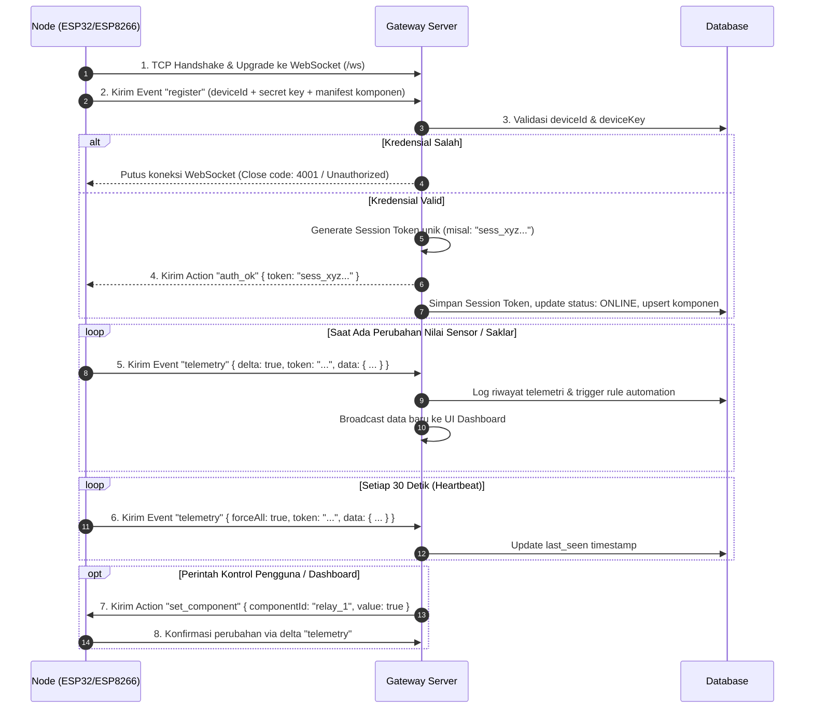

# Panduan & Spesifikasi Pengembangan IoT Gateway Server 🌐
### Pendamping Resmi Library `AgyGatewayClient` (ESP8266 & ESP32)

Dokumen ini adalah **spesifikasi teknis resmi (system blueprint & contract specification)** untuk pengembang yang membangun atau mengembangkan **Gateway Server** (berbasis Node.js, Python, Go, dll.) yang berkomunikasi dengan node mikrokontroler menggunakan library [AgyGatewayClient](file:///d:/iot/libs/AgyGatewayClient/src/AgyGatewayClient.h).

---

## 📑 Daftar Isi
1. [Arsitektur Komunikasi & Transport Layer](#1-arsitektur-komunikasi--transport-layer)
2. [Siklus Hidup Perangkat & Handshake Autentikasi](#2-siklus-hidup-perangkat--handshake-autentikasi)
3. [Spesifikasi Protokol Inbound (Node ➔ Server)](#3-spesifikasi-protokol-inbound-node--server)
   - [A. Event `register` (Manifest Komponen)](#a-event-register-manifest-komponen)
   - [B. Event `telemetry` (Delta & Heartbeat)](#b-event-telemetry-delta--heartbeat)
   - [C. Event `ota_progress`](#c-event-ota_progress)
   - [D. Event `i2c_scan_result`](#d-event-i2c_scan_result)
4. [Spesifikasi Protokol Outbound (Server ➔ Node)](#4-spesifikasi-protokol-outbound-server--node)
   - [A. Action `auth_ok` (Konfirmasi Token)](#a-action-auth_ok-konfirmasi-token)
   - [B. Action `set_component` (Kontrol Komponen & Timer Mandiri)](#b-action-set_component-kontrol-komponen--timer-mandiri)
   - [C. Action `cancel_timer`](#c-action-cancel_timer)
   - [D. Action `ota_update`](#d-action-ota_update)
   - [E. Action `virtual_write`](#e-action-virtual_write)
   - [F. Action `scan_i2c`](#f-action-scan_i2c)
   - [G. Dynamic Pin Management (`configure_pin`, `remove_pin`, `apply_pin_config`)](#g-dynamic-pin-management)
   - [H. Action `get_status`](#h-action-get_status)
5. [Presence Management & Deteksi Online/Offline](#5-presence-management--deteksi-onlineoffline)
6. [Rekomendasi Skema Database (Data Modeling)](#6-rekomendasi-skema-database-data-modeling)
7. [Spesifikasi REST API untuk Web Dashboard & Frontend](#7-spesifikasi-rest-api-untuk-web-dashboard--frontend)
8. [Contoh Implementasi Minimal Server (Node.js + `ws`)](#8-contoh-implementasi-minimal-server-nodejs--ws)
9. [Edge Cases & Panduan Penanganan Error](#9-edge-cases--panduan-penanganan-error)

---

## 1. Arsitektur Komunikasi & Transport Layer

* **Protokol:** WebSocket murni (RFC 6455).
* **Transport:** `ws://` (Plain TCP, default port `3050`) atau `wss://` (TLS/SSL terenkripsi).
* **Format Payload:** JSON teks utf-8 (`ArduinoJson` format).
* **Default Path:** `/ws` (dapat dikonfigurasi saat `iot.begin(...)`).

```
+----------------------------------------------------------------+
|                   WEB BROWSER / MOBILE APP                     |
+----------------------------------------------------------------+
       |                                          ^
       | HTTP REST API (Kontrol & Monitoring)      | SSE / WebSocket
       v                                          | (Live UI Update)
+----------------------------------------------------------------+
|                     IOT GATEWAY SERVER                         |
|   - WebSocket Hub (Port 3050, Endpoint /ws)                    |
|   - Token Authentication & Session Store                       |
|   - Database (Devices, Components, Logs, Automations)          |
|   - Rule Engine / Automation Engine                            |
+----------------------------------------------------------------+
       ^                                          |
       | Inbound WebSocket JSON                   | Outbound Actions
       | (register, telemetry, ota_progress)      | (set_component, ota, pins)
       v                                          v
+----------------------------------------------------------------+
|               MIKROKONTROLER (AgyGatewayClient)                |
|               ESP8266 / ESP32 Universal Node                   |
+----------------------------------------------------------------+
```

---

## 2. Siklus Hidup Perangkat & Handshake Autentikasi

Untuk mengamankan jaringan dari transmisi `deviceKey` berulang, `AgyGatewayClient` menerapkan **Session Token Handshake**:



---

## 3. Spesifikasi Protokol Inbound (Node ➔ Server)

### A. Event `register` (Manifest Komponen)
Dikirim otomatis oleh node sesaat setelah koneksi WebSocket terbuka atau saat server meminta via `get_status`.

#### Contoh Payload:
```json
{
  "event": "register",
  "deviceId": "esp32-livingroom",
  "key": "SEC_KEY_ABC123",
  "token": "sess_98af21d09e8c45ab89",
  "info": {
    "chip": "ESP32",
    "firmware": "1.2.0",
    "uptime": 142,
    "rssi": -65,
    "dynamicPins": true
  },
  "components": [
    {
      "id": "relay_1",
      "name": "Lampu Ruang Tamu",
      "type": "switch",
      "driver": "switch",
      "access": "rw",
      "value": "false",
      "pin": 18,
      "timer": {
        "active": true,
        "remaining": 45,
        "total": 120
      }
    },
    {
      "id": "dimmer_lamp",
      "name": "Lampu Belajar",
      "type": "dimmer",
      "driver": "dimmer",
      "access": "rw",
      "unit": "%",
      "value": "75",
      "pin": 19
    },
    {
      "id": "bmp_temp",
      "name": "Suhu Ruangan",
      "type": "sensor",
      "driver": "bmp280",
      "access": "r",
      "unit": "°C",
      "value": "27.40",
      "i2cAddr": 118
    }
  ]
}
```

#### Field Description:
| Field | Tipe | Deskripsi |
|---|---|---|
| `event` | `string` | Selalu bernilai `"register"`. |
| `deviceId` | `string` | Identifier unik perangkat. |
| `key` | `string` | Secret key perangkat untuk verifikasi pertama kali. |
| `token` | `string` (opsional) | Terisi jika node sebelumnya sudah memegang session token. |
| `info.chip` | `string` | `"ESP32"`, `"ESP8266"`, atau `"Arduino"`. |
| `info.firmware` | `string` | Versi library `AgyGatewayClient` (misal `"1.2.0"`). |
| `info.uptime` | `number` | Uptime node dalam detik. |
| `info.rssi` | `number` | Kekuatan sinyal WiFi dalam dBm. |
| `info.dynamicPins` | `boolean` | `true` jika node mendukung konfigurasi pin via web. |
| `components` | `array` | Daftar komponen yang terdaftar pada node. |
| `components[].type` | `string` | Tipe: `"switch"`, `"dimmer"`, `"sensor"`, `"custom"`. |
| `components[].access` | `string` | Hak akses: `"r"` (read-only), `"w"` (write-only), `"rw"` (read-write). |
| `components[].timer` | `object` (opsional) | Hadir jika countdown timer hardware sedang aktif. |

---

### B. Event `telemetry` (Delta & Heartbeat)
Node mengirim telemetri dalam 2 mode:
1. **Delta Telemetry (`delta: true`):** Hanya menyertakan komponen yang nilainya berubah (dilengkapi rate limiter 50ms di mikrokontroler).
2. **Full Heartbeat Telemetry:** Dikirim berkala setiap 30 detik menyertakan semua komponen.

#### Contoh Payload Delta Telemetry:
```json
{
  "event": "telemetry",
  "deviceId": "esp32-livingroom",
  "token": "sess_98af21d09e8c45ab89",
  "uptime": 195,
  "rssi": -62,
  "delta": true,
  "data": {
    "relay_1": "true",
    "bmp_temp": "28.10"
  }
}
```

#### Logika Penanganan di Server:
1. Validasi `token` sesi atau `key`.
2. Lakukan update nilai parsial ke cache in-memory / database untuk setiap key di `data`.
3. Update `last_seen` dan `rssi` perangkat.
4. Teruskan payload ke subscriber WebSocket dashboard frontend.
5. Jalankan evaluasi Rule Engine / Otomasi (misal: jika `bmp_temp > 30` maka nyalakan kipas).

---

### C. Event `ota_progress`
Dilaporkan otomatis oleh mikrokontroler setiap progres unduh bertambah 10% dan saat selesai 100%.

#### Contoh Payload:
```json
{
  "event": "ota_progress",
  "deviceId": "esp32-livingroom",
  "percent": 60,
  "current": 491520,
  "total": 819200
}
```

#### Tindakan Server:
* Broadcast ke dashboard agar admin dapat melihat live progress bar proses flash firmware.

---

### D. Event `i2c_scan_result`
Dikirim oleh node setelah mengeksekusi instruksi `scan_i2c` dari server.

#### Contoh Payload:
```json
{
  "event": "i2c_scan_result",
  "deviceId": "esp32-livingroom",
  "key": "SEC_KEY_ABC123",
  "devices": [
    {
      "address": "0x76",
      "name": "BMP280",
      "category": "Sensor Suhu & Tekanan"
    },
    {
      "address": "0x23",
      "name": "BH1750",
      "category": "Sensor Cahaya (Lux)"
    }
  ]
}
```

---

## 4. Spesifikasi Protokol Outbound (Server ➔ Node)

Semua instruksi dari server dikirim dalam format JSON dengan properti utama `"action"`.

### A. Action `auth_ok` (Konfirmasi Token)
Kirimkan segera setelah memvalidasi `event: "register"`.

```json
{
  "action": "auth_ok",
  "token": "sess_98af21d09e8c45ab89"
}
```

---

### B. Action `set_component` (Kontrol Komponen & Timer Mandiri)
Mengubah status saklar atau persentase dimmer.

#### 1. Kontrol Saklar (Biasa):
```json
{
  "action": "set_component",
  "componentId": "relay_1",
  "value": true
}
```
*(Catatan: `value` dapat berupa boolean `true`/`false` atau integer `1`/`0`)*.

#### 2. Kontrol Dimmer (PWM):
```json
{
  "action": "set_component",
  "componentId": "dimmer_lamp",
  "value": 85
}
```
*(Nilai antara `0` hingga `100`)*.

#### 3. Kontrol Saklar dengan Hardware Countdown Timer:
```json
{
  "action": "set_component",
  "componentId": "relay_1",
  "value": true,
  "duration": 600
}
```
> [!IMPORTANT]
> Properti `duration` (dalam detik) akan menyalakan timer countdown di chip ESP. Mikrokontroler akan menghitung waktu secara mandiri dan otomatis mematikan relay saat waktu habis, **meskipun koneksi WiFi/Server tiba-tiba terputus!**

---

### C. Action `cancel_timer`
Membatalkan countdown timer yang sedang berjalan pada switch tertentu:
```json
{
  "action": "cancel_timer",
  "componentId": "relay_1"
}
```

---

### D. Action `ota_update`
Memicu node untuk mengunduh dan melakukan flashing firmware secara Over-The-Air:
```json
{
  "action": "ota_update",
  "url": "http://192.168.1.100:3050/firmwares/esp32_v1.2.1.bin"
}
```
* **Kebutuhan HTTP Server:** Server file firmware harus mengembalikan header `Content-Length` dan `Content-Type: application/octet-stream`.

---

### E. Action `virtual_write`
Mengirim data ke Virtual Pin ala Blynk:
```json
{
  "action": "virtual_write",
  "pin": "V1",
  "value": "RESET_COUNTER"
}
```

---

### F. Action `scan_i2c`
Memerintahkan node untuk melakukan scan bus I2C:
```json
{
  "action": "scan_i2c",
  "sda": 21,
  "scl": 22
}
```
*(Jika `sda` dan `scl` bernilai `-1`, node akan menggunakan default pin I2C)*.

---

### G. Dynamic Pin Management
Hanya berfungsi jika node mengaktifkan `iot.enableDynamicPins(true)`.

#### 1. Menambah / Memperbarui Satu Pin (`configure_pin`):
```json
{
  "action": "configure_pin",
  "id": "relay_garden",
  "name": "Lampu Taman",
  "type": "switch",
  "driver": "switch",
  "pin": 23,
  "activeLow": true
}
```

#### 2. Menghapus Pin (`remove_pin`):
```json
{
  "action": "remove_pin",
  "id": "relay_garden"
}
```

#### 3. Batch Update Konfigurasi Seluruh Pin (`apply_pin_config`):
```json
{
  "action": "apply_pin_config",
  "components": [
    { "id": "relay_1", "name": "Relay 1", "type": "switch", "pin": 5 },
    { "id": "dht_room", "name": "DHT22", "type": "sensor", "driver": "dht22", "pin": 4 }
  ]
}
```

---

### H. Action `get_status`
Meminta node mengirimkan ulang manifest `register` lengkap:
```json
{
  "action": "get_status"
}
```

---

## 5. Presence Management & Deteksi Online/Offline

Mikrokontroler mengirimkan heartbeat penuh setiap **30 detik**.

### Strategi Deteksi Offline:
1. **Event `ws.on('close')`:** Jika koneksi TCP terputus secara bersih, server dapat langsung mengubah status perangkat ke `OFFLINE`.
2. **Heartbeat Watchdog (Zombie Socket):** Jika koneksi putus tiba-tiba (misal kabel listrik node dicabut), socket TCP mungkin tetap terbuka. Server harus memiliki interval timer:
   * **Ambang Batas (Threshold):** `45 – 60 detik`.
   * Jika dalam 60 detik tidak ada paket WebSocket apapun dari `deviceId`, tandai perangkat sebagai `OFFLINE` di database dan notifikasikan ke dashboard.

---

## 6. Rekomendasi Skema Database (Data Modeling)

Berikut adalah struktur entitas database yang direkomendasikan:

### 1. Tabel / Koleksi `devices`
| Kolom / Field | Tipe | Deskripsi |
|---|---|---|
| `id` | VARCHAR(64) PK | Identifier unik (`deviceId`, misal `esp32-livingroom`) |
| `name` | VARCHAR(100) | Nama display ramah pengguna |
| `secret_key` | VARCHAR(128) | Secret key perangkat |
| `session_token` | VARCHAR(128) | Token sesi aktif saat ini |
| `status` | ENUM('online', 'offline') | Status kehadiran node |
| `chip` | VARCHAR(32) | ESP32 / ESP8266 |
| `firmware` | VARCHAR(32) | Versi firmware client |
| `ip_address` | VARCHAR(45) | IP address lokal node |
| `rssi` | INT | Kuat sinyal WiFi (dBm) |
| `last_seen` | TIMESTAMP | Waktu terakhir kali menerima paket data |

### 2. Tabel / Koleksi `components`
| Kolom / Field | Tipe | Deskripsi |
|---|---|---|
| `id` | VARCHAR(64) | ID komponen (unik per device, misal `relay_1`) |
| `device_id` | VARCHAR(64) FK | Relasi ke tabel `devices` |
| `name` | VARCHAR(100) | Label komponen |
| `type` | VARCHAR(32) | `switch`, `dimmer`, `sensor`, `custom` |
| `driver` | VARCHAR(32) | `switch`, `dimmer`, `bmp280`, `dht22`, dll. |
| `access` | VARCHAR(4) | `r`, `w`, `rw` |
| `pin` | INT | Nomor GPIO (opsional) |
| `i2c_addr` | INT | Alamat I2C jika sensor I2C |
| `unit` | VARCHAR(16) | Satuan (misal `°C`, `%`, `Lux`) |
| `current_value`| VARCHAR(64) | Nilai terbaru saat ini |
| `updated_at` | TIMESTAMP | Waktu update terakhir |

### 3. Tabel / Koleksi `telemetry_logs` (Time-Series)
| Kolom / Field | Tipe | Deskripsi |
|---|---|---|
| `id` | BIGINT AUTO_PK | ID log |
| `device_id` | VARCHAR(64) FK | ID perangkat |
| `component_id`| VARCHAR(64) | ID komponen |
| `value` | VARCHAR(64) | Nilai saat itu |
| `recorded_at` | TIMESTAMP | Waktu pencatatan |

---

## 7. Spesifikasi REST API untuk Web Dashboard & Frontend

REST API ini digunakan oleh antarmuka dashboard untuk mengelola dan mengontrol perangkat:

| Method | Endpoint | Deskripsi | Body / Parameter |
|---|---|---|---|
| `GET` | `/api/devices` | Ambil semua daftar node & status | - |
| `GET` | `/api/devices/:id` | Detail lengkap satu node & komponennya | - |
| `POST` | `/api/devices/:id/components/:compId/control` | Kontrol status switch / dimmer | `{ "value": true, "duration": 60 }` |
| `POST` | `/api/devices/:id/cancel-timer` | Batalkan countdown relay | `{ "componentId": "relay_1" }` |
| `POST` | `/api/devices/:id/ota` | Picu update firmware | `{ "firmwareUrl": "..." }` |
| `POST` | `/api/devices/:id/scan-i2c` | Request scan I2C bus | `{ "sda": 21, "scl": 22 }` |
| `POST` | `/api/devices/:id/pins` | Tambah/Ubah dynamic pin | `{ "id": "fan", "pin": 12, ... }` |
| `DELETE`| `/api/devices/:id/pins/:compId` | Hapus dynamic pin | - |
| `GET` | `/api/devices/:id/history` | Riwayat grafik telemetri sensor | `?componentId=bmp_temp&range=24h` |

---

## 8. Contoh Implementasi Minimal Server (Node.js + `ws`)

Simpan file ini sebagai referensi arsitektur minimal pengembangan gateway:

```javascript
// server_reference.js
const http = require('http');
const express = require('express');
const { WebSocketServer } = require('ws');
const crypto = require('crypto');

const app = express();
app.use(express.json());

const server = http.createServer(app);
const wss = new WebSocketServer({ server, path: '/ws' });

// In-Memory Device & Connection Registry
const connectedSockets = new Map(); // deviceId -> ws
const registeredDevices = new Map(); // deviceId -> { secretKey, sessionToken, status, lastSeen, components }

// Dummy master secret key (pada implementasi nyata, ambil dari database)
const MASTER_KEY = "SEC_KEY_ABC123";

wss.on('connection', (ws, req) => {
  let authenticatedDeviceId = null;
  console.log(`[WS] Client terhubung dari: ${req.socket.remoteAddress}`);

  ws.on('message', (message) => {
    try {
      const payload = JSON.parse(message.toString());
      const event = payload.event;

      // 1. Inbound Event: REGISTER
      if (event === 'register') {
        const { deviceId, key, token, info, components } = payload;

        // Validasi Key atau Session Token
        if (key !== MASTER_KEY && (!token || token !== registeredDevices.get(deviceId)?.sessionToken)) {
          console.warn(`[AUTH FAIL] Percobaan registrasi gagal untuk: ${deviceId}`);
          ws.send(JSON.stringify({ error: 'unauthorized' }));
          ws.close(4001, 'Unauthorized');
          return;
        }

        // Buat session token baru jika belum ada
        const sessionToken = token || `sess_${crypto.randomBytes(12).toString('hex')}`;
        authenticatedDeviceId = deviceId;
        connectedSockets.set(deviceId, ws);

        registeredDevices.set(deviceId, {
          secretKey: key,
          sessionToken,
          status: 'online',
          lastSeen: Date.now(),
          info,
          components: components || []
        });

        console.log(`[AUTH OK] Node '${deviceId}' terdaftar (${info?.chip}, FW: ${info?.firmware})`);

        // Balas dengan auth_ok
        ws.send(JSON.stringify({
          action: 'auth_ok',
          token: sessionToken
        }));
        return;
      }

      // 2. Inbound Event: TELEMETRY
      if (event === 'telemetry') {
        const { deviceId, token, data, delta, uptime, rssi } = payload;
        const dev = registeredDevices.get(deviceId);

        if (!dev || (token && dev.sessionToken !== token)) {
          console.warn(`[TELEMETRY REJECTED] Token tidak valid dari: ${deviceId}`);
          return;
        }

        dev.lastSeen = Date.now();
        dev.status = 'online';

        // Update nilai komponen
        if (data && typeof data === 'object') {
          for (const [compId, newVal] of Object.entries(data)) {
            const comp = dev.components.find(c => c.id === compId);
            if (comp) comp.value = newVal;
            console.log(`[DATA ${delta ? 'DELTA' : 'SYNC'}] ${deviceId} -> ${compId}: ${newVal}`);
          }
        }
        return;
      }

      // 3. Inbound Event: OTA PROGRESS
      if (event === 'ota_progress') {
        console.log(`[OTA PROGRESS] ${payload.deviceId}: ${payload.percent}% (${payload.current}/${payload.total} bytes)`);
        return;
      }

      // 4. Inbound Event: I2C SCAN RESULT
      if (event === 'i2c_scan_result') {
        console.log(`[I2C SCAN] ${payload.deviceId} menemukan ${payload.devices?.length} perangkat I2C:`, payload.devices);
        return;
      }

    } catch (err) {
      console.error('[WS PARSE ERROR]', err.message);
    }
  });

  ws.on('close', () => {
    if (authenticatedDeviceId) {
      connectedSockets.delete(authenticatedDeviceId);
      const dev = registeredDevices.get(authenticatedDeviceId);
      if (dev) dev.status = 'offline';
      console.log(`[WS CLOSED] Node '${authenticatedDeviceId}' terputus.`);
    }
  });
});

// Periodic Watchdog (Heartbeat Checker)
setInterval(() => {
  const now = Date.now();
  for (const [id, dev] of registeredDevices.entries()) {
    if (dev.status === 'online' && now - dev.lastSeen > 60000) {
      dev.status = 'offline';
      console.warn(`[WATCHDOG TIMEOUT] Node '${id}' ditandai OFFLINE (tidak ada heartbeat selama 60 detik).`);
    }
  }
}, 15000);

// REST API Endpoints untuk Dashboard Web
app.get('/api/devices', (req, res) => {
  const list = Array.from(registeredDevices.entries()).map(([id, d]) => ({
    id,
    status: d.status,
    lastSeen: d.lastSeen,
    info: d.info,
    componentCount: d.components.length
  }));
  res.json({ success: true, data: list });
});

// Kontrol Komponen Saklar / Dimmer
app.post('/api/devices/:id/control', (req, res) => {
  const { id } = req.params;
  const { componentId, value, duration } = req.body;

  const ws = connectedSockets.get(id);
  if (!ws || ws.readyState !== ws.OPEN) {
    return res.status(404).json({ success: false, error: 'Device tidak sedang online' });
  }

  const actionPayload = {
    action: 'set_component',
    componentId,
    value,
    duration: duration || 0
  };

  ws.send(JSON.stringify(actionPayload));
  res.json({ success: true, message: `Perintah kontrol dikirim ke ${id}`, payload: actionPayload });
});

const PORT = 3050;
server.listen(PORT, () => {
  console.log(`🚀 Gateway Server berjalan di http://localhost:${PORT}`);
  console.log(`📡 WebSocket endpoint siap di ws://localhost:${PORT}/ws`);
});
```

---

## 9. Edge Cases & Panduan Penanganan Error

1. **Koersi Tipe Data Nilai Boolean:**
   * Di C++, nilai boolean switch sering dikonversi menjadi string `"true"` / `"false"` atau integer `1` / `0`.
   * Server harus toleran: `const isTrue = val === true || val === "true" || val === 1 || val === "1";`.

2. **Rate Limiting Delta Telemetry:**
   * Mikrokontroler menerapkan pembatas laju transmisi minimal 50ms antar pengiriman delta data. Server tidak perlu khawatir terkena *packet flooding* berlebihan dari perubahan sensor analog mikrodetik.

3. **Silent Disconnection (Koneksi Putus Tanpa TCP FIN):**
   * Jangan hanya mengandalkan event `ws.on('close')`. Selalu gunakan watchdog timer berbasis `lastSeen` (threshold 45–60 detik) untuk mendeteksi perangkat mati akibat mati listrik mendadak.

4. **Kapasitas Buffer JSON Mikrokontroler:**
   * `AgyGatewayClient` menggunakan `JsonDocument` dinamis (ArduinoJson v7). Hindari mengirim array komponen yang berisi ratusan objek sekaligus dalam 1 frame untuk mencegah out-of-memory (OOM) pada ESP8266 (heap terbatas).
