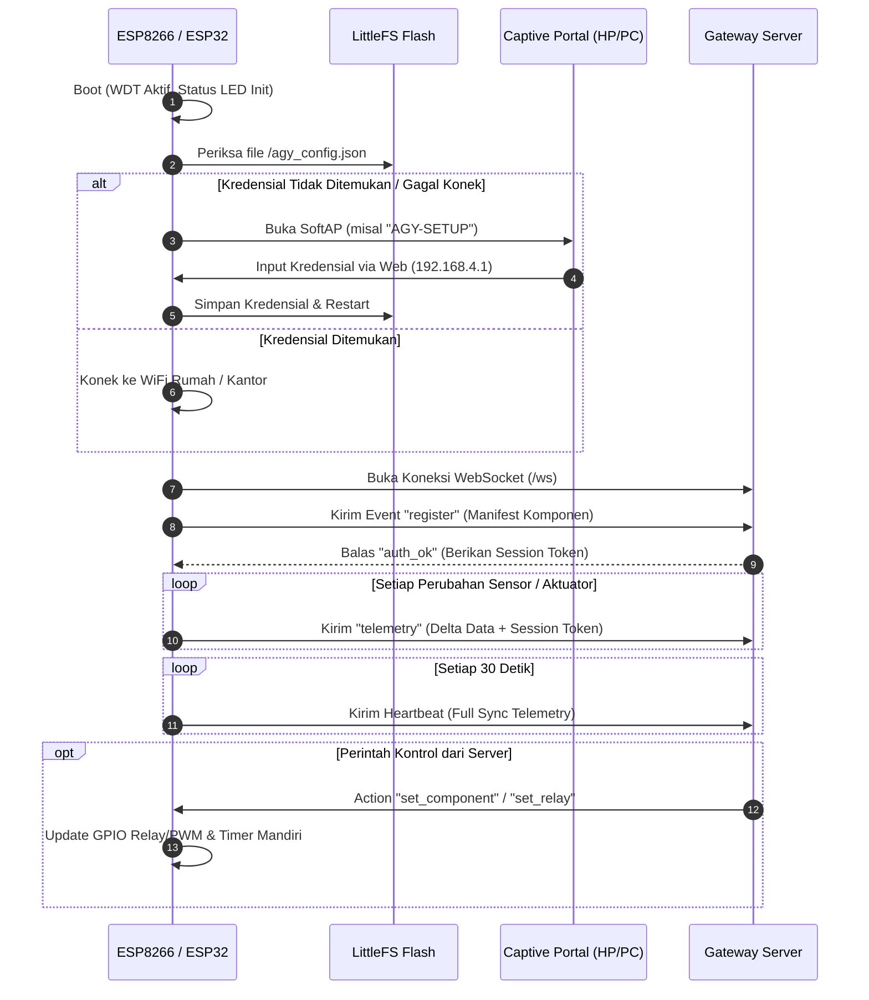

# AgyGatewayClient 🚀

[](https://platformio.org/)
[](https://www.arduino.cc/)
[](https://espressif.com/)
[](https://github.com/SiMahfud/AgyGatewayClient)
[](https://opensource.org/licenses/MIT)

**AgyGatewayClient** adalah library IoT universal modular untuk mikrokontroler **ESP8266** (Wemos D1 Mini, NodeMCU, ESP-01) dan **ESP32** (ESP32-WROOM, NodeMCU-32S, ESP32-C3, ESP32-S3) yang dirancang untuk menghubungkan node perangkat ke **Personal IoT Gateway Server** secara instan, tangguh, dan fleksibel.

Library ini dirancang untuk dua tipe pengguna:
- **Pengguna Awam / Non-Programmer**: Cukup upload sketch sekali (*Zero-Code Universal Node*), lalu konfigurasi WiFi, server, sensor, dan saklar sepenuhnya lewat HP/Laptop dan Web Dashboard tanpa perlu coding lagi.
- **Pengguna Mahir / Embedded Engineers**: Kontrol penuh melalui C++ API, manajemen memori aman (*stable pointer references*), driver native mikrokontroler berakurasi tinggi (kompensasi kalibrasi resmi Bosch BMP280), Hardware Watchdog Timer (WDT), pengamanan token sesi, dan protokol komunikasi WebSocket real-time.

---

## 📑 Daftar Isi
- [✨ Fitur Utama](#-fitur-utama)
- [🏗️ Arsitektur & Alur Kerja Sistem](#️-arsitektur--alur-kerja-sistem)
- [📦 Panduan Instalasi](#-panduan-instalasi)
- [🔰 Panduan Cepat Pemula (Quickstart 5 Menit — Zero-Code)](#-panduan-cepat-pemula-quickstart-5-menit--zero-code)
- [📌 Panduan Pinout & Wiring Hardware](#-panduan-pinout--wiring-hardware)
- [💻 Contoh Penggunaan C++ (Manual Coding)](#-contoh-penggunaan-c-manual-coding)
  - [1. Smart Switch & Dimmer Actuator](#1-smart-switch--dimmer-actuator)
  - [2. Multi-Sensor Weather Station](#2-multi-sensor-weather-station)
  - [3. Virtual Pins & Custom Callbacks](#3-virtual-pins--custom-callbacks)
- [🌐 WiFi Captive Portal & Auto-Connect](#-wifi-captive-portal--auto-connect)
- [💾 Flash Persistence (LittleFS)](#-flash-persistence-littlefs)
- [🐕 Hardware Watchdog Timer (WDT)](#-hardware-watchdog-timer-wdt)
- [🔐 Keamanan & Session Token Handshake](#-keamanan--session-token-handshake)
- [📡 Spesifikasi Format Protokol WebSocket JSON](#-spesifikasi-format-protokol-websocket-json)
- [🔍 Driver Sensor & Aktuator Native (Zero-Dependency)](#-driver-sensor--aktuator-native-zero-dependency)
- [📚 Referensi Lengkap C++ API](#-referensi-lengkap-c-api)
- [💡 Indikator Status LED](#-indikator-status-led)
- [❓ Tanya Jawab & Troubleshooting (FAQ)](#-tanya-jawab--troubleshooting-faq)
- [📄 Lisensi](#-lisensi)

---

## ✨ Fitur Utama

- 🌐 **WiFi Captive Portal Cerdas**: Konfigurasi SSID, Sandi WiFi, IP Server Gateway, Port, Device ID & Key via browser HP/Laptop. Otomatis menampilkan pop-up hotspot di Android, iOS, dan Windows.
- 🔒 **Proteksi Kata Sandi AP WPA2**: Access Point konfigurasi lokal dapat dikunci dengan sandi (WPA2-PSK) untuk mencegah orang lain mengakses konfigurasi perangkat.
- 💾 **Flash Persistence (LittleFS)**: Konfigurasi jaringan dan pemetaan pin tersimpan permanen di memori Flash. Perangkat otomatis pulih dan bekerja normal saat mati listrik.
- ⚡ **Real-Time WebSocket Dua Arah**: Komunikasi latensi rendah dengan auto-reconnect, heartbeat berkala, proteksi Device Key, dan token sesi (`auth_ok`).
- 📊 **Delta Telemetry & Rate Limiting**: Hanya mengirimkan perubahan nilai sensor/aktuator ke server. Dilengkapi rate limiter otomatis (50ms) untuk mencegah network packet burst.
- ⏱️ **Independent Hardware Countdown Timer**: Timer countdown relay berjalan mandiri di prosesor chip ESP. Tetap mematikan beban tepat waktu meskipun koneksi internet terputus.
- 🐕 **Hardware Watchdog Timer (WDT)**: Melindungi mikrokontroler dari freeze/lock permanen pada bus I2C atau 1-Wire dengan auto-restart hardware.
- 🎛️ **Dimmer & PWM Slider Support**: Mendukung aktuator lampu redup (dimmer), kecepatan kipas, atau motor DC dengan skala 0–100%.
- ☁️ **Over-The-Air (OTA) Updates**: Update firmware `.bin` jarak jauh (HTTP & HTTPS) dengan auto-retry 3x dan live progress feedback (0–100%) ke dashboard server.
- 🔍 **Native Drivers (Zero-Dependency)**: Pembacaan sensor tanpa library eksternal: BMP280 (kalibrasi penuh Bosch Sensortec), DHT11/DHT22 (timing aman interrupt), DS18B20 (1-Wire Dallas), BH1750 (Lux), SHT30, dan AHT10/AHT20.
- 👥 **Auto-Companion Sensors**: Sensor parameter ganda otomatis memunculkan komponen pendamping di dashboard (`_hum` untuk kelembapan, `_press` untuk tekanan atmosfer).
- 🌐 **Virtual Pins Ala Blynk**: Kompatibel dengan konsep Virtual Pin (`V0`, `V1`, `V2`, dst) untuk kemudahan integrasi.

---

## 🏗️ Arsitektur & Alur Kerja Sistem

Berikut adalah alur hidup mikrokontroler saat menggunakan `AgyGatewayClient`:



---

## 📦 Panduan Instalasi

### A. Pengguna PlatformIO (Sangat Direkomendasikan)
Tambahkan library ke `platformio.ini` pada proyek Anda:

```ini
[env:d1_mini]
platform = espressif8266
board = d1_mini
framework = arduino
monitor_speed = 115200

lib_deps = 
    https://github.com/SiMahfud/AgyGatewayClient.git
```
*(PlatformIO akan mengunduh dependensi `ArduinoJson` (v7+) dan `WebSockets` secara otomatis)*.

### B. Pengguna Arduino IDE
1. Buka halaman GitHub repository ini, klik tombol hijau **Code** > **Download ZIP**.
2. Buka **Arduino IDE**.
3. Pilih menu **Sketch** > **Include Library** > **Add .ZIP Library...**.
4. Pilih file `.zip` yang telah diunduh.
5. Pastikan Anda telah memasang dependensi berikut via **Library Manager** (Ctrl+Shift+I):
   - **ArduinoJson** (versi 7.x atau lebih baru) oleh Benoit Blanchon.
   - **WebSockets** oleh Markus Sattler.

---

## 🔰 Panduan Cepat Pemula (Quickstart 5 Menit — Zero-Code)

Jika Anda tidak ingin menulis kode C++ setiap kali menambah relay atau sensor baru, gunakan konsep **Universal Node**:

### Langkah 1: Upload Sketch Universal Node
Buka Arduino IDE / PlatformIO, buat sketch baru dan upload kode berikut:

```cpp
#include <Arduino.h>
#include <AgyGatewayClient.h>

AgyGatewayClient iot;

void setup() {
  Serial.begin(115200);

  // 1. Aktifkan Hardware Watchdog Timer (8 detik)
  iot.enableWatchdog(8);

  // 2. Aktifkan LED Status (Kedip untuk diagnosa)
  iot.enableStatusLed(LED_BUILTIN, true);

  // 3. Aktifkan konfigurasi dinamis pin via Web
  iot.enableDynamicPins(true);

  // 4. Hubungkan ke WiFi tersimpan, atau buka Captive Portal ber-password jika belum ada
  iot.autoConnect("AGY-SETUP", "admin1234", 60);
}

void loop() {
  iot.loop();
}
```

### Langkah 2: Hubungkan Smartphone / Laptop ke Modul
1. Nyalakan modul ESP Anda. Jika modul belum memiliki konfigurasi WiFi, LED akan berkedip sangat cepat.
2. Buka pengaturan WiFi di HP atau Laptop Anda. Cari jaringan WiFi bernama **`AGY-SETUP`**.
3. Masukkan kata sandi AP: **`admin1234`** *(atau tanpa sandi jika Anda menggunakan `iot.autoConnect()` default)*.
4. Pop-up halaman login Captive Portal akan muncul otomatis. Jika tidak muncul, buka browser dan ketik alamat: **`http://192.168.4.1`**.

### Langkah 3: Isi Formulir Konfigurasi
Halaman konfigurasi modern akan tampil:
- **SSID WiFi**: Nama WiFi rumah/kantor Anda.
- **WiFi Password**: Kata sandi WiFi Anda.
- **Gateway Host**: Alamat IP komputer / server gateway (contoh: `192.168.1.100` atau domain `iot.myhome.local`).
- **Gateway Port**: Port server (default: `3050`).
- **WebSocket Path**: Path endpoint (default: `/ws`).
- **Gunakan SSL (WSS)**: Centang jika gateway Anda menggunakan protokol aman `wss://`.
- **Device ID**: Nama unik perangkat (contoh: `node-dapur`, `wemos-kamar`).
- **Device Key**: Kunci rahasia autentikasi perangkat yang terdaftar di server.

Klik tombol **Simpan & Sambungkan**. Modul akan me-restart, menyimpan pengaturan ke Flash LittleFS, dan langsung terhubung ke Gateway Server Anda!

---

## 📌 Panduan Pinout & Wiring Hardware

Agar mikrokontroler dapat boot dengan aman tanpa gagal booting, perhatikan pemetaan pin GPIO berikut:

### 1. Wemos D1 Mini / NodeMCU (ESP8266)
| Pin Label | GPIO | Rekomendasi Penggunaan | Catatan Hardware |
|-----------|------|------------------------|------------------|
| **D1** | GPIO 5 | **SCL (I2C) / Relay / Sensor** | Sangat Aman (Default SCL) |
| **D2** | GPIO 4 | **SDA (I2C) / Relay / Sensor** | Sangat Aman (Default SDA) |
| **D5** | GPIO 14 | **Relay / Dimmer PWM / DHT** | Sangat Aman |
| **D6** | GPIO 12 | **Relay / Dimmer PWM / DHT** | Sangat Aman |
| **D7** | GPIO 13 | **Relay / Dimmer PWM / 1-Wire** | Sangat Aman |
| **D3** | GPIO 0 | Tombol Input (Pull-Up) | Boot gagal jika di-ground saat start |
| **D4** | GPIO 2 | LED Built-in (Active LOW) | Boot gagal jika di-ground saat start |
| **D8** | GPIO 15 | Switch Output | Wajib pull-down saat booting |
| **A0** | ADC0 | **Sensor Analog (0 - 3.3V)** | Rentang input 0 - 1.0V (max 3.3V dengan resistor pembagi Wemos) |

### 2. ESP32 (30 / 38 Pin DevKit)
| Pin Label | GPIO | Rekomendasi Penggunaan |
|-----------|------|------------------------|
| **GPIO 21** | 21 | **SDA (I2C)** (Default Wire) |
| **GPIO 22** | 22 | **SCL (I2C)** (Default Wire) |
| **GPIO 4, 16, 17, 18, 19, 23** | Bebas | **Relay, Dimmer PWM, DHT, DS18B20** |
| **GPIO 34, 35, 36, 39** | ADC1 | **Sensor Analog (Input Only, Tanpa Pull-Up)** |
| **GPIO 2** | 2 | On-board LED (Active HIGH pada umumnya) |

---

## 💻 Contoh Penggunaan C++ (Manual Coding)

Bagi pengguna mahir yang ingin mendefinisikan komponen secara eksplisit di dalam kode C++:

### 1. Smart Switch & Dimmer Actuator
Mengontrol relay lampu on/off serta dimmer pengatur kecerahan/kecepatan (PWM):

```cpp
#include <Arduino.h>
#include <AgyGatewayClient.h>

AgyGatewayClient iot;

void setup() {
  Serial.begin(115200);

  // Aktifkan Watchdog Timer (8 detik)
  iot.enableWatchdog(8);

  // Daftarkan relay (id, pin, nama, activeLow, initialState)
  iot.addSwitch("relay_1", 5,  "Lampu Utama", true);
  iot.addSwitch("relay_2", 4,  "Kipas Exhaust", true);

  // Daftarkan actuator Dimmer / PWM (id, pin, nama, unit, initialValue)
  // Nilai 0 - 100% (otomatis dikonversi ke resolusi PWM mikrokontroler)
  iot.addDimmer("dimmer_1", 12, "Lampu Tidur", "%", 40);

  // Konek langsung ke WiFi & Server Gateway
  iot.begin("WiFi_SSID", "WiFi_PASS", "192.168.1.100", 3050, "/ws", "node-kamar", "SECRET_KEY_123");
}

void loop() {
  iot.loop();
}
```

### 2. Multi-Sensor Weather Station
Membaca sensor kustom secara berkala dengan interval pembacaan otomatis:

```cpp
#include <Arduino.h>
#include <AgyGatewayClient.h>

AgyGatewayClient iot;

float getSimulatedTemp() {
  return 28.4 + (random(-10, 10) / 10.0);
}

float getSoilMoisture() {
  return analogRead(A0);
}

void setup() {
  Serial.begin(115200);
  iot.enableWatchdog(8);

  // Daftarkan fungsi sensor: dibaca otomatis setiap interval (ms)
  iot.addSensor("sensor_suhu", "Suhu Ruang", "°C", getSimulatedTemp, 5000);
  iot.addSensor("soil_moist",  "Kelembapan Tanah", "ADC", getSoilMoisture, 10000);

  // Tambahkan aktuator pompa penyiram otomatis
  iot.addSwitch("pump_relay", 14, "Pompa Air", true);

  iot.begin("WiFi_SSID", "WiFi_PASS", "192.168.1.100", 3050, "/ws", "weather-node", "SECRET_KEY_123");
}

void loop() {
  iot.loop();
}
```

### 3. Virtual Pins & Custom Callbacks
Berkomunikasi layaknya Virtual Pin di Blynk, serta menerima event mentah dari server:

```cpp
#include <Arduino.h>
#include <AgyGatewayClient.h>

AgyGatewayClient iot;

void setup() {
  Serial.begin(115200);
  iot.enableWatchdog(8);

  // 1. Listener untuk Virtual Pin V1 dari dashboard
  iot.onVirtualWrite("V1", [](const String& pin, const String& value) {
    Serial.printf("[VIRTUAL] Pin %s diatur ke: %s\n", pin.c_str(), value.c_str());
  });

  // 2. Listener universal untuk semua komponen
  iot.onCommand([](const String& compId, const String& value) {
    Serial.printf("[COMMAND] Komponen '%s' diubah ke '%s'\n", compId.c_str(), value.c_str());
  });

  // 3. Listener status koneksi WebSocket
  iot.onConnection([](bool isConnected) {
    Serial.printf("[WS] Status: %s\n", isConnected ? "ONLINE" : "OFFLINE");
  });

  iot.begin("WiFi_SSID", "WiFi_PASS", "192.168.1.100", 3050, "/ws", "vpin-node", "SECRET_KEY_123");
}

void loop() {
  iot.loop();

  // Kirim data telemetri ke Virtual Pin V2 setiap 5 detik
  static unsigned long lastSent = 0;
  if (millis() - lastSent > 5000) {
    lastSent = millis();
    int randomData = random(10, 100);
    iot.virtualWrite("V2", randomData);
  }
}
```

---

## 🌐 WiFi Captive Portal & Auto-Connect

Captive Portal library ini berjalan secara mandiri tanpa memerlukan library tambahan pihak ketiga.

### Opsi Pemanggilan `autoConnect()`:
```cpp
// 1. Default: AP Terbuka (nama: AGY-NODE-[CHIPID], timeout 60s)
iot.autoConnect();

// 2. Custom AP Terbuka dengan batas timeout koneksi WiFi
iot.autoConnect("MY-SMART-NODE", 90);

// 3. Custom AP Terproteksi Sandi WPA2 (Minimal 8 karakter)
iot.autoConnect("MY-SECURE-NODE", "sandi12345", 60);

// 4. Paksa buka portal tanpa mencoba koneksi tersimpan (misal saat tombol reset fisik ditekan)
iot.startPortal("MY-SETUP-AP", "sandi12345");
```

### Mekanisme Captive Portal:
- Server DNS lokal membajak semua query domain (`*`) ke IP `192.168.4.1`.
- Mendukung endpoint deteksi otomatis Android (`/generate_204`), Apple iOS/macOS (`/hotspot-detect.html`), dan Windows (`/connecttest.txt`, `/ncsi.txt`).
- Sanitasi input form otomatis memangkas spasi liar (*trimming*) dan karakter kontrol tak terlihat.
- Radio SoftAP dimatikan seutuhnya (`WiFi.mode(WIFI_STA)`) setelah konfigurasi selesai untuk menghemat daya dan memori.

---

## 💾 Flash Persistence (LittleFS)

Semua data konfigurasi disimpan di dalam partisi flash mikrokontroler menggunakan sistem file **LittleFS**:

| File Flash | Deskripsi & Format |
|------------|---------------------|
| `/agy_config.json` | Kredensial jaringan: `ssid`, `pass`, `host`, `port`, `path`, `deviceId`, `key`, `ssl`. |
| `/agy_pins.json` | Konfigurasi dynamic components & sensors array (disimpan saat diatur dari Dashboard Web). |

### Method Manajemen Flash:
```cpp
iot.savePinConfigToStorage();   // Simpan state komponen dinamis ke LittleFS
iot.loadPinConfigFromStorage();   // Muat kembali pemetaan pin dari LittleFS
iot.clearPinStorage();            // Hapus file /agy_pins.json
iot.clearAllStorage();            // Factory Reset (hapus kredensial WiFi dan pin)
```

---

## 🐕 Hardware Watchdog Timer (WDT)

Dalam sistem IoT yang menyala 24/7, mikrokontroler rentan mengalami *freeze/lockup* tak terduga bila bus sensor I2C atau 1-Wire macet. Library ini menyediakan proteksi Hardware WDT bawaan:

```cpp
// Aktifkan WDT dengan batas waktu timeout (default 8 detik)
iot.enableWatchdog(8);

// Beri makan (feed) watchdog secara manual (otomatis dipanggil di iot.loop())
iot.feedWatchdog();

// Nonaktifkan watchdog jika diperlukan
iot.disableWatchdog();
```

- **ESP8266**: Menggunakan Hardware WDT internal chip (`ESP.wdtEnable()`).
- **ESP32**: Mendukung arsitektur Task Watchdog Timer (`esp_task_wdt`) baik untuk ESP-IDF v4 maupun ESP-IDF v5+.
- Watchdog otomatis di-feed saat proses OTA berukuran besar dan loop koneksi WiFi.

---

## 🔐 Keamanan & Session Token Handshake

Untuk melindungi **Device Secret Key** dari transmisi berulang di jaringan lokal:

1. Saat pertama kali WebSocket terhubung, node mengirimkan manifest registrasi berisi `key`.
2. Server memvalidasi `key` dan membalas dengan event/action `auth_ok` serta memberikan `token` sesi sementara.
3. Seluruh transmisi delta telemetri berikutnya akan menggunakan `"token": "..."` tanpa lagi memaparkan `key`.

Jika Anda ingin menonaktifkan pengiriman `key` pada telemetri bahkan sebelum token diterima:
```cpp
iot.setSendKeyOnTelemetry(false);
```

---

## 📡 Spesifikasi Format Protokol WebSocket JSON

Bagian ini penting bagi pengembang Gateway Server / Dashboard Web.

### 1. Registrasi Client -> Server (`event: "register"`)
Dikirim otomatis oleh node sesaat setelah WebSocket `CONNECTED`:
```json
{
  "event": "register",
  "deviceId": "node-kamar",
  "key": "SECRET_KEY_123",
  "info": {
    "chip": "ESP8266",
    "firmware": "1.2.0",
    "uptime": 24,
    "rssi": -62,
    "dynamicPins": true
  },
  "components": [
    {
      "id": "relay_1",
      "name": "Lampu Utama",
      "type": "switch",
      "driver": "switch",
      "access": "rw",
      "value": "false",
      "pin": 5
    },
    {
      "id": "dimmer_1",
      "name": "Lampu Tidur",
      "type": "dimmer",
      "driver": "dimmer",
      "access": "rw",
      "unit": "%",
      "value": "40",
      "pin": 12
    },
    {
      "id": "bmp_temp",
      "name": "Suhu Ruang",
      "type": "sensor",
      "driver": "bmp280",
      "access": "r",
      "unit": "°C",
      "value": "28.5",
      "i2cAddr": 118
    }
  ]
}
```

### 2. Konfirmasi Autentikasi Server -> Client (`action: "auth_ok"`)
Server mengirimkan token sesi setelah memvalidasi `key`:
```json
{
  "action": "auth_ok",
  "token": "sess_98af21d09e8c45ab89"
}
```

### 3. Delta Telemetry Client -> Server (`event: "telemetry"`)
Dikirim instan saat nilai komponen berubah (menghemat bandwidth):
```json
{
  "event": "telemetry",
  "deviceId": "node-kamar",
  "token": "sess_98af21d09e8c45ab89",
  "uptime": 125,
  "rssi": -59,
  "delta": true,
  "data": {
    "dimmer_1": "75"
  }
}
```

### 4. Full Telemetry Sync Heartbeat (`event: "telemetry"`)
Dikirim berkala setiap 30 detik untuk sinkronisasi menyeluruh:
```json
{
  "event": "telemetry",
  "deviceId": "node-kamar",
  "token": "sess_98af21d09e8c45ab89",
  "uptime": 150,
  "rssi": -60,
  "data": {
    "relay_1": "false",
    "dimmer_1": "75",
    "bmp_temp": "28.6",
    "bmp_temp_press": "1012.3"
  }
}
```

### 5. Kontrol Komponen Server -> Client (`action: "set_component"`)
Mengatur status Switch (ON/OFF) atau Dimmer (0–100%):
```json
{
  "action": "set_component",
  "componentId": "dimmer_1",
  "value": 85
}
```
*Dengan timer countdown lokal mandiri:*
```json
{
  "action": "set_component",
  "componentId": "relay_1",
  "value": true,
  "duration": 120
}
```

### 6. Pembatalan Timer Server -> Client (`action: "cancel_timer"`)
```json
{
  "action": "cancel_timer",
  "componentId": "relay_1"
}
```

### 7. Over-The-Air Update Server -> Client (`action: "ota_update"`)
```json
{
  "action": "ota_update",
  "url": "http://192.168.1.100:3050/firmwares/update_v1.2.1.bin"
}
```

### 8. Live OTA Progress Client -> Server (`event: "ota_progress"`)
Dilaporkan setiap kenaikan 10% selama proses unduh firmware berlangsung:
```json
{
  "event": "ota_progress",
  "deviceId": "node-kamar",
  "percent": 40,
  "current": 184320,
  "total": 460800
}
```

### 9. Scan I2C Bus Jarak Jauh Server -> Client (`action: "scan_i2c"`)
```json
{
  "action": "scan_i2c",
  "sda": 4,
  "scl": 5
}
```
*Respon dari node:*
```json
{
  "event": "i2c_scan_result",
  "deviceId": "node-kamar",
  "devices": [
    { "address": 118, "hex": "0x76", "name": "BMP280 / BME280", "category": "Suhu & Tekanan Udara" }
  ]
}
```

### 10. Konfigurasi Dynamic Pin Server -> Client (`action: "configure_pin"`)
```json
{
  "action": "configure_pin",
  "id": "dht_kamar",
  "name": "Sensor Suhu & Kelembapan",
  "driver": "dht22",
  "pin": 14,
  "interval": 3000
}
```

---

## 🔍 Driver Sensor & Aktuator Native (Zero-Dependency)

Library ini memprogram register sensor secara langsung tanpa memerlukan dependensi library pihak ketiga:

| Driver Sensor / Aktuator | String `driver` | Tipe Bus / Pin | Output & Fitur Unggulan |
|--------------------------|-----------------|----------------|-------------------------|
| **Relay / Switch** | `switch` | GPIO Output | Saklar ON/OFF dengan timer countdown lokal. |
| **Dimmer / PWM** | `dimmer` | GPIO Output | Nilai 0–100% (skala otomatis ke 8-bit / 10-bit PWM). |
| **Digital Input** | `digital_in` | GPIO Input | Sensor PIR, sensor pintu, switch magnetik (Debounce 50ms). |
| **Analog ADC** | `analog` | ADC Pin | Pembacaan tegangan / sensor tanah / potensiometer. |
| **BMP280 / BME280** | `bmp280` | I2C (0x76 / 0x77) | Suhu (°C) & Tekanan (hPa) dengan rumus kompensasi 24-byte calibration Bosch Sensortec. Auto companion: `{id}_press`. |
| **BH1750** | `bh1750` | I2C (0x23 / 0x5C) | Sensor intensitas cahaya ruangan (Lux). |
| **DHT11 / DHT22** | `dht11`, `dht22` | 1-Wire Digital | Bit-banging terproteksi `noInterrupts()` dan aman dari rollover `micros()`. Auto companion: `{id}_hum`. |
| **DS18B20** | `ds18b20` | 1-Wire Digital | Sensor suhu tahan air Dallas dengan validasi scratchpad CRC. |
| **SHT30 / SHT31** | `sht30` | I2C (0x44 / 0x45) | Suhu & Kelembapan presisi tinggi Sensirion. Auto companion: `{id}_hum`. |
| **AHT10 / AHT20** | `aht10` | I2C (0x38) | Suhu & Kelembapan digital. Auto companion: `{id}_hum`. |

---

## 📚 Referensi Lengkap C++ API

### Inisialisasi & Setup
| Method | Deskripsi |
|--------|-----------|
| `begin(ssid, pass, host, port, path, deviceId, key, useSsl)` | Inisialisasi jaringan dan target WebSocket Gateway Server lengkap. |
| `begin(ssid, pass, wsUrl, deviceId, key)` | Inisialisasi ringkas dengan URL WebSocket lengkap (contoh: `ws://192.168.1.100:3050/ws`). |
| `autoConnect(apName, apPass, timeoutSec)` | Auto-connect dengan membaca flash. Jika gagal, buka AP Captive Portal terproteksi sandi. |
| `startPortal(apName, apPass)` | Paksa menyalakan AP Captive Portal secara manual. |
| `loop()` | Wajib dipanggil di dalam `void loop()` Arduino. Menangani WebSocket, WDT, timer, dan telemetri. |

### Hardware Watchdog Timer
| Method | Deskripsi |
|--------|-----------|
| `enableWatchdog(timeoutSec = 8)` | Mengaktifkan hardware watchdog timer (ESP8266 & ESP32). |
| `disableWatchdog()` | Menonaktifkan hardware watchdog timer. |
| `feedWatchdog()` | Me-reset timer watchdog agar chip tidak reboot. |

### Status LED
| Method | Deskripsi |
|--------|-----------|
| `enableStatusLed(pin = LED_BUILTIN, activeLow = true)` | Mengaktifkan kedipan LED status koneksi. |
| `disableStatusLed()` | Mematikan fitur LED status dan mengembalikan pin ke keadaan mati. |

### Komponen & Aktuator
| Method | Deskripsi |
|--------|-----------|
| `addSwitch(id, pin, name, activeLow, initialState)` | Mendaftarkan saklar relay output digital. |
| `addDimmer(id, pin, name, unit, initialValue)` | Mendaftarkan aktuator dimmer PWM slider (0–100%). |
| `setSwitchState(id, state)` | Mengubah status relay secara lokal via kode C++. |
| `setDimmerValue(id, value)` | Mengubah nilai PWM dimmer secara lokal via kode C++. |

### Sensor & Telemetri
| Method | Deskripsi |
|--------|-----------|
| `addSensor(id, name, unit, readFn, intervalMs)` | Mendaftarkan sensor dengan fungsi pembacaan berkala. |
| `updateSensor(id, floatValue)` | Memperbarui nilai sensor dan memicu delta telemetri. |
| `updateSensor(id, stringValue)` | Memperbarui nilai sensor bertipe string. |
| `sendTelemetry(forceAll = false)` | Mengirimkan data telemetri (default delta, `forceAll=true` untuk full sync). |
| `sendFullTelemetry()` | Mengirimkan seluruh komponen tanpa mempedulikan status perubahan. |
| `setSendKeyOnTelemetry(enable)` | Mengatur apakah Device Key ikut dikirimkan pada payload telemetri. |
| `getAuthToken()` | Mendapatkan token sesi yang diberikan server saat handshake `auth_ok`. |

### Virtual Pins & Callbacks
| Method | Deskripsi |
|--------|-----------|
| `virtualWrite(vPin, value)` | Mengirim nilai ke Virtual Pin tertentu (`V1`, `V2`, dst). |
| `onVirtualWrite(vPin, callback)` | Menangkap penulisan Virtual Pin dari server. |
| `onCommand(callback)` | Menangkap semua instruksi kontrol komponen dari server. |
| `onConnection(callback)` | Mendeteksi event connect / disconnect WebSocket. |

### Flash Storage & Dynamic Pins
| Method | Deskripsi |
|--------|-----------|
| `enableDynamicPins(true)` | Mengaktifkan pemulihan dan penyimpanan komponen dinamis dari LittleFS. |
| `clearPinStorage()` | Menghapus pemetaan pin dinamis dari flash. |
| `clearAllStorage()` | Menghapus seluruh pengaturan (WiFi, Server, dan Pin) untuk Factory Reset. |
| `scanAndReportI2C(sdaPin, sclPin)` | Memindai bus I2C dan mengirimkan laporannya ke server. |

---

## 💡 Indikator Status LED

Jika `enableStatusLed()` diaktifkan, lampu LED modul akan memberikan informasi diagnosa visual:

| Pola Kedip LED | Arti Status Perangkat | Tindakan Pengguna |
|----------------|------------------------|-------------------|
| **Kedip Sangat Cepat** (~100ms) | Captive Portal AP Aktif | Sambungkan HP ke AP modul untuk konfigurasi. |
| **Kedip Cepat** (~250ms) | Sedang Menghubungkan ke WiFi | Pastikan router WiFi aktif dan SSID/sandi benar. |
| **Kedip Lambat** (~600ms) | WiFi OK, Menghubungkan ke Server | Pastikan Server Gateway hidup dan port terbuka. |
| **Mati (OFF)** | **Normal / Terhubung Penuh** | Node siap digunakan dan beroperasi normal. |

---

## ❓ Tanya Jawab & Troubleshooting (FAQ)

#### Q: Mengapa setelah disimpan di Captive Portal, modul tidak mau terhubung ke WiFi?
**A**: Periksa kembali apakah SSID dan password WiFi menggunakan pita frekuensi 2.4 GHz. ESP8266 dan ESP32 tidak mendukung jaringan WiFi 5 GHz. Pastikan sinyal WiFi cukup kuat di lokasi perangkat.

#### Q: Mengapa relay menyala saat modul pertama kali dinyalakan?
**A**: Sebagian besar modul relay IoT bersifat **Active LOW** (menyala saat pin LOW). Gunakan parameter `activeLow = true` (default) pada `addSwitch()` dan `configurePin()`.

#### Q: Kenapa I2C scanner tidak mendeteksi sensor saya?
**A**: 
1. Pastikan jalur SDA dan SCL tidak terbalik (Default ESP8266: D2=SDA, D1=SCL. ESP32: GPIO 21=SDA, GPIO 22=SCL).
2. Modul I2C membutuhkan tegangan VCC (3.3V atau 5V) dan GND yang stabil.
3. Pastikan sensor Anda memiliki resistor pull-up (biasanya sudah terpasang pada modul breakout umum).

#### Q: Apakah aman menggunakan timer relay saat koneksi internet putus?
**A**: Sangat aman. Timer countdown dijalankan oleh prosesor chip mikrokontroler secara mandiri (*independent hardware timer*). Relay akan tetap mati tepat waktu meskipun router dimatikan.

#### Q: Bagaimana cara melakukan Factory Reset total jika saya berpindah jaringan WiFi?
**A**: Anda dapat memanggil method `iot.clearAllStorage();` lalu `ESP.restart();` melalui sketch, atau menambahkan tombol fisik yang memanggil `iot.startPortal();`.

---

## 📄 Lisensi

Proyek ini dilisensikan di bawah lisensi **MIT License** — Anda bebas menggunakan, memodifikasi, dan mengintegrasikannya ke dalam proyek komersial maupun personal.
